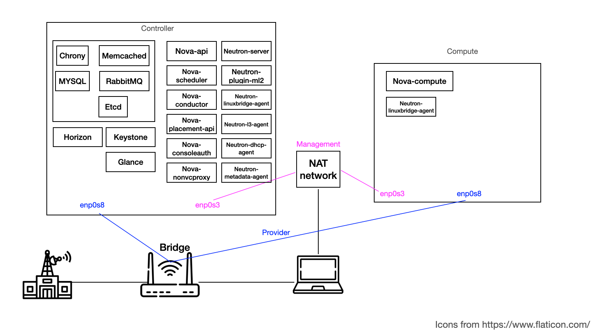

# Openstack manual installation
All script files are based on OpenStack installation Guide (https://docs.openstack.org/install-guide/index.html).
Especially for user who wants to install OpenStack(Queens ver) on Ubuntu 18.04.
If you use other linux or other ubuntu verson, the scripts shouldn't do well.
## Environment
- Common
    - ubuntu 18.04, 2NIC
- Controller node
    - CORE 4>= RAM >=6GB, HDD >=100GB 
- Compute node
    - CORE 4>= RAM >=4GB, HDD >=50GB 
## Minimal OpenStack architecture

- Controller node - Horizon, Keystone, Glance, Nova-api, Neutron-server
- Compute node - Nova-api, Neutron-linuxbridge-agent
## Usage
**On Root Permission**
### 1. Configure common-config
```
vi common-config
```
### 2. Run common.sh on each node
```
/bin/sh common.sh
```
### 3. Run compute.sh on compute node
```
cd /compute
/bin/sh compute.sh
```
### 4. Run controller.sh on controller node
```
cd /controller
/bin/sh controller.sh
```
### 5. Run after-installation.sh on controller node
```
/bin/sh after-installation.sh
```